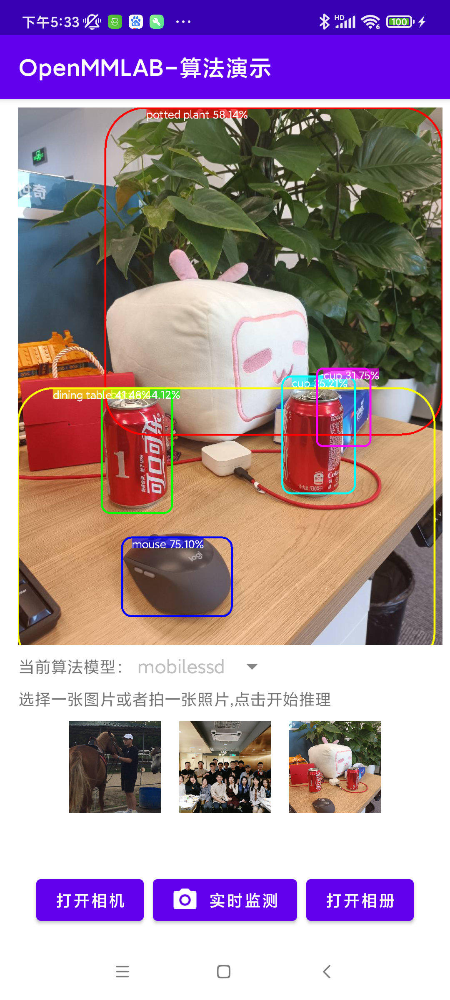
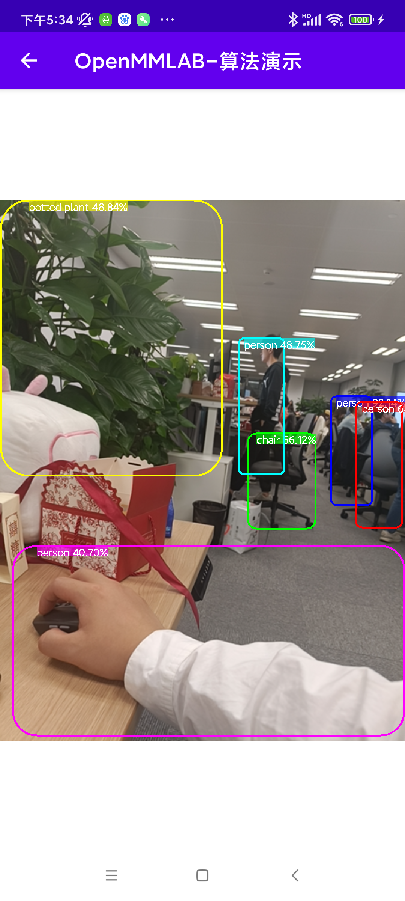

# Object-Detection-App
基于OpenMMLab推理工具[MMDeploy](https://github.com/open-mmlab/mmdeploy) 以及目标检测框架[MMDetection](https://github.com/open-mmlab/mmdetection) 开发的android app。

试用下载链接[点击此处](https://openmmlab-open.oss-cn-shanghai.aliyuncs.com/test/openmmlan-mobile-v1.2.0.apk)

## 代码测试和微调
打开Android Studio,使用import project直接导入这个目录opbject-detection-app,等待stduio编译完就可以开始使用了。
在studio中切换到Android页面：
app
├── manifests        
├── java       
│       ├── mmdeploy     app的后端代码       
├── assets           MMDeploy转换的模型储存在这       
├── jniLibs          MMdeploy的第三方组件       
├── res                     
│       ├── layout       app的前端代码       

## 软件内部展示
图片离线推理展现，目前支持三种模型的离线推理：

手机摄像头实时检测：

